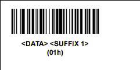
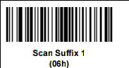

SKXXX - RS507 Connection Repair
-------------------------------
Purpose
~~~~~~~
To re-pair the RS507 to the Nexus in the event of an unpairing. 

IMPORTANT: Follow entire document if device shows up as anything other than a keyboard on the phone, Otherwise refer to the Re-pair section of the document.

Change scanner to HID(Human Interface Device) Mode
~~~~~~~~~~~~~~~~~~~~~~~~~~~~~~~~~~~~~~~~~~~~~~~~~~
* Perform a clean boot to the RS507
** Remove Battery from the RS507
** Press and hold *Restore Key* (button on the side of the RS507)
** Install the battery into the RS507
** Keep holding the *Restore Key* until a chirp is heard and the *Scan LEDs* flash green
* Scan the HID bar code

image:images/HID.jpg[]

* Perform a *Cold Boot* by removing and re-installing the battery of the RS507.  The RS507 will now operate and is discoverable as a keyboard.

Add a Carriage Return to the RS507
++++++++++++++++++++++++++++++++++
* Scan the <Data><suffix 1> bar code to allow for the carriage return

* Scan the Scan Suffix 2 to initiate the Carriage return function on the RS507

* Perform a *Cold Boot* by removing and re-installing the battery of the RS507.  The RS507 will now operate and is discoverable as a keyboard.

Re-Pair the RS507 with a Phone
~~~~~~~~~~~~~~~~~~~~~~~~~~~~~~
TIP: Note the S/N of the RS507 Scanner which is located under the battery on the RS507 ie S/N 16060000500029

* Unpair the RS507 with any devices it might be paired to by scanning the bar code

* Go to your Phone → Settings → Turn on your Bluetooth
* On the phone click on the Keyboard icon that matches the S/N of the RS507 located on the RS507 under the battery
* When paired, you will hear the RS507 chirp
* To test if the setup worked: Open Chrome → Select the URL → Use the scanner and scan any bar code
** If it worked: the bar code number would essentially be copied into the URL
** If it did not work: Double check that the scanner and phone are properly paired
*** To reconnect the RS507 to the Nexus 5 phone, hit the reset button on the side.  A simple press and release will do
* If successful you will hear the RS507 Chirp
* *DO NOT HOLD THE BUTTON DOWN FOR A LONG PERIOD OF TIME THIS WILL WARM RESET THE DEVICE AND WILL NEED TO BE RE-PAIRED WITH THE NEXUS 5*

