SKXXX - RS507 Set up
--------------------
Purpose 
~~~~~~~
To set up an RS507 Ring Imager for use in the Warehouse.

Procedure
^^^^^^^^^

Note: At anytime you can restart the process outside of when the firmware is updating by performing a Clean Boot
^^^^^^^^^^^^^^^^^^^^^^^^^^^^^^^^^^^^^^^^^^^^^^^^^^^^^^^^^^^^^^^^^^^^^^^^^^^^^^^^^^^^^^^^^^^^^^^^^^^^^^^^^^^^^^^^

* Clean Boot
** Remove Battery from the RS507
** Press and hold *Restore Key* (button on the side of the RS507)
** Install the battery into the RS507
** Keep holding the *Restore Key* until a chirp is heard and the *Scan LEDs* flash green

Upgrade the Firmware of the RS507
~~~~~~~~~~~~~~~~~~~~~~~~~~~~~~~~~
* Unpair the RS507 from any previous devices by scanning the bar code

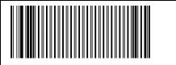

* Run the RS507PCTOOL

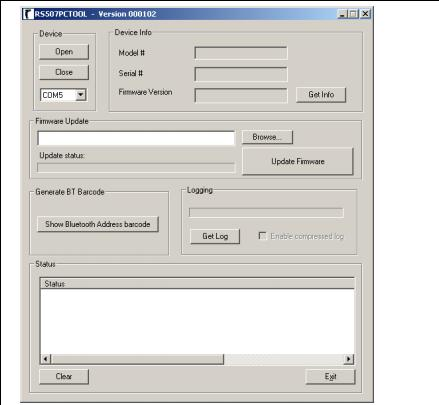

* Establish an SSI connection by scanning the bar code.  This will set up the RS507 as a discoverable Camera

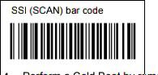

* Perform a *Cold Boot* by removing and re-installing the battery of the RS507.  The RS507 will now operate and is discoverable as a keyboard.
* On the computer *right click* the bluetooth icon and select add a device.

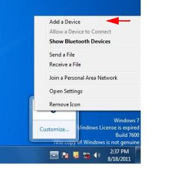

* From the *Add a Device* select the RS507

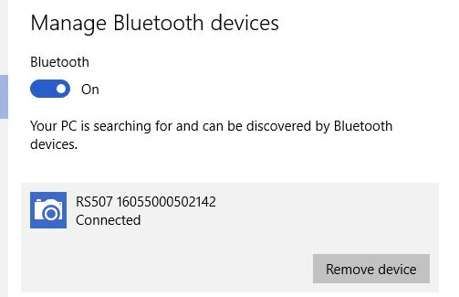

* Once paired, Find the port that the RS507 was assigned to by going to the bluetooth icon on the taskbar and select the option *Open Settings* 
* Select the *COM Ports* tab to find the Outgoing and Incoming ports

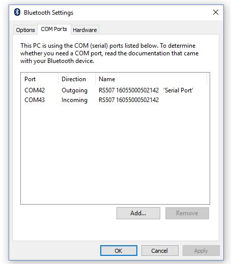

* Select the Outgoing COM port in the dropdown menu that was assigned to the RS507 on the RS507PCTOOL and click the *open* button.  The device information will be displayed on the screen

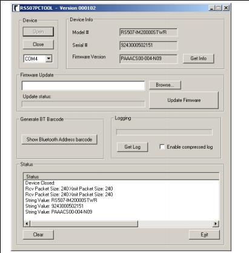

* There are *two* firmware updates that need to be completed
* Click the browse button and select the first firmware dat file. (PAAACS00-005-R05D0.DAT) This is located in ThisPC > Downloads > wetransfer-4c718f
* Click the *Update Firmware* button

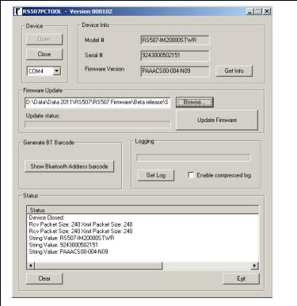

* During this time the RS507 Scann LEDs will blink *Red*, When the firmware update successfully ends, wait
for RS507 internal flash programming to complete (the Scan LEDs turn off). 
* Once completed perform a warm boot by pressing and holding the *Restore Key* for more than six seconds
* For the second firmware update, perform these steps:
* Click the *Close* button on the RS507PCTOOL, this will close the connection between the RS507 and the RS507PCTOOL
* Re-open the connection by clicking the Open button on the RS507PCTOOL

* Click the browse button and select the second firmware dat file. (PAAACS00-005-R05D0_BT_HID_INTER_CHAR_DELY_10MS_SPR27986.DAT) This is located in ThisPC > Downloads > wetransfer-4c718f
* Click the *Update Firmware* button

* During this time the RS507 Scann LEDs will blink *Red*, When the firmware update successfully ends, wait
for RS507 internal flash programming to complete (the Scan LEDs turn off).
* Once completed perform a warm boot by pressing and holding the *Restore Key* for more than six seconds
* After the second warm boot is complete, unpair the device from the computer by pressing the *Remove Device* button next to the RS507 on the computer, and scanning the *Un-pairing* bar code

 

Change scanner to HID(Human Interface Device) Mode
~~~~~~~~~~~~~~~~~~~~~~~~~~~~~~~~~~~~~~~~~~~~~~~~~~
* Perform a clean boot to the RS507
** Remove Battery from the RS507
** Press and hold *Restore Key* (button on the side of the RS507)
** Install the battery into the RS507
** Keep holding the *Restore Key* until a chirp is heard and the *Scan LEDs* flash green
* Scan the HID bar code

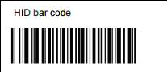

* Perform a *Cold Boot* by removing and re-installing the battery of the RS507.  The RS507 will now operate and is discoverable as a keyboard.

Add a Carriage Return to the RS507
~~~~~~~~~~~~~~~~~~~~~~~~~~~~~~~~~~
* Scan the <Data><suffix 1> bar code to allow for the carriage return

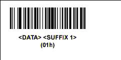

* Scan the Scan Suffix 2 to initiate the Carriage return function on the RS507

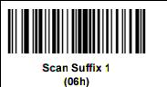

* Perform a *Cold Boot* by removing and re-installing the battery of the RS507.  The RS507 will now operate and is discoverable as a keyboard.

Pair the RS507 with a Phone
~~~~~~~~~~~~~~~~~~~~~~~~~~~
* Note the S/N of the RS507 Scanner which is located under the battery on the RS507 ie S/N 16060000500029

* Unpair the RS507 with any devices it might be paired to by scanning the bar code

* Go to your Phone → Settings → Turn on your Bluetooth
* On the phone click on the Keyboard icon that matches the S/N of the RS507 located on the RS507 under the battery
* When paired, you will hear the RS507 chirp
* To test if the setup worked: Open Chrome → Select the URL → Use the scanner and scan any bar code
** If it worked: the bar code number would essentially be copied into the URL
** If it did not work: Double check that the scanner and phone are properly paired 
*** To reconnect the RS507 to the Nexus 5 phone, hit the reset button on the side.  A simple press and release will do
* If successful you will hear the RS507 Chirp
* *DO NOT HOLD THE BUTTON DOWN FOR A LONG PERIOD OF TIME THIS WILL WARM RESET THE DEVICE AND WILL NEED TO BE RE-PAIRED WITH THE NEXUS 5*

For Troubleshooting Refer to SKXXX- RS507 Connection Repair
~~~~~~~~~~~~~~~~~~~~~~~~~~~~~~~~~~~~~~~~~~~~~~~~~~~~~~~~~~~

