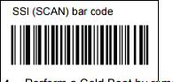
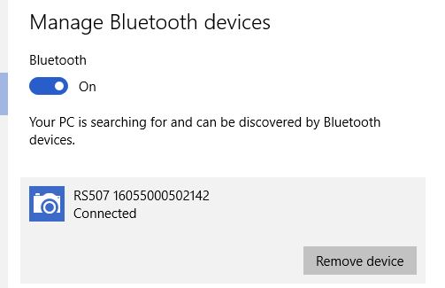
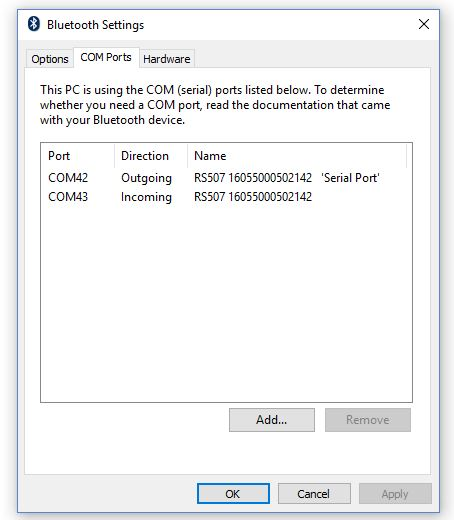
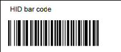

SKXXX - How to Setup an RS507 Ring Imager
-----------------------------------------
Purpose 
~~~~~~~
Update the RS507 firmware and pair the RS507 with a smart phone for use in the
warehouse.

Procedure
~~~~~~~~~
Please refer to the three different types of *RS507 Boots* as needed.

.RS507 Clean Boot
****
You can restart the process at any time by performing a *Clean Boot*, except
when the firmware is updating.

* Remove the battery
* Press and hold the *Restore Key* (side button) for a few seconds
* Install the battery
* Press and hold down the *Restore Key* until the device beeps and flashes green
****

.RS507 Warm Boot
****
* Press and hold the *Restore Key* (side button) for at least six seconds
****

.RS507 Cold Boot
****
* Remove the battery
* Insert the battery
****

Step 1: Install the RS507PCTool
~~~~~~~~~~~~~~~~~~~~~~~~~~~~~~~
* The RS507PCTool is located at
`\\sksna01\Software\Standalone\RS507\RS507PCTOOL000103.DAT`

Step 2: Update the RS507 Firmware
~~~~~~~~~~~~~~~~~~~~~~~~~~~~~~~~~
* Scan the barcode to unpair from any previous devices

image:images/Unpair.jpg[]

* Run RS507PCTOOL

image:images/PCTool.jpg[]

* Scan the barcode to establish an SSI connection
** Device will now show as a discoverable camera

* Perform a *Cold Boot*
* On the computer, right click the *bluetooth icon* and select *Add a Bluetooth
Device*

* Select the *RS507* device

* Once paired, right click the *bluetooth icon* again → *Open Settings*
* Select the *COM Ports* tab to find the Outgoing COM Port

* On the RS507PCTOOL dropdown, select your corresponding Outgoing COM Port → 
Click *Open*

image:images/PCToolDisplay.jpg[]

There are *two* firmware updates that need to be completed:

*Firmware Update 1*

* Click *Browse* → `\\sksna01\Software\Standalone\RS507\PAAACS00-005-R05D0.DAT`
* Click *Update Firmware*
** The LEDs will flash *red* during the update and turn off when completed
* Once completed, press and hold the *Restore Key* for at least six seconds to
perform a *Warm Boot*
* On the RS507PCTOOL → Click *Close*

image:images/PCToolDisplayUpdate.jpg[]

*Firmware Update 2*

* Re-run RS507PCTool
* Click *Open* to re-establish the connection to the device
* Click *Browse* → `\\sksna01\Software\Standalone\RS507\PAAACS00-005-R05D0_BT_HID_INTER_CHAR_DELY_10MS_SPR27986.DAT`
* Click *Update Firmware*
** The LEDs will flash *red* during the update and turn off when completed
* Once completed, press and hold the *Restore Key* for at least six seconds to
perform a *Warm Boot*

image:images/PCToolDisplayUpdate.jpg[]

* Right click the *bluetooth icon* → *Remove device*

 

* Scan the barcode to unpair from the computer

image:images/Unpair.jpg[]

Step 3: Configure the RS507 - HID Mode
~~~~~~~~~~~~~~~~~~~~~~~~~~~~~~~~~~~~~~
* Perform a *Clean Boot*
* Scan the HID (Human Interface Device) barcode

* Perform a *Cold Boot*
** The device is now discoverable as a keyboard

Step 4: Configure the RS507 - Carriage Return
~~~~~~~~~~~~~~~~~~~~~~~~~~~~~~~~~~~~~~~~~~~~~
* Scan the *<DATA><SUFFIX 1>* barcode to allow for the carriage return

image:images/Scan1.jpg[]

* Scan the *Scan Suffix 1* barcode to initiate the Carriage return function on the RS507

image:images/ScanCR.jpg[]

* Perform a *Cold Boot*
** The device is now discoverable as a keyboard

Step 5: Pair the RS507 with a Phone
~~~~~~~~~~~~~~~~~~~~~~~~~~~~~~~~~~~
* Scan the following barcode to clear out all previous connections

image:images/Unpair.jpg[]

* Locate the serial number under the battery

* On the Phone → Settings → Turn on the Bluetooth
* Select the serial number of your device
** Success: You will hear a beep

Step 6: Test the RS507 Ring Imager
~~~~~~~~~~~~~~~~~~~~~~~~~~~~~~~~~~
* Open Chrome → Select the URI → Scan any barcode
** Success: The scanned barcode will appear in the URI
** Failure: Double check *Step 5*
